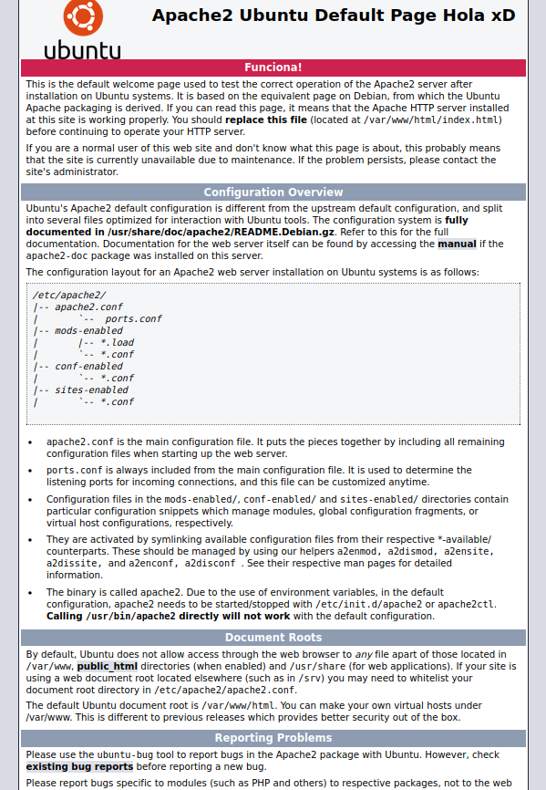
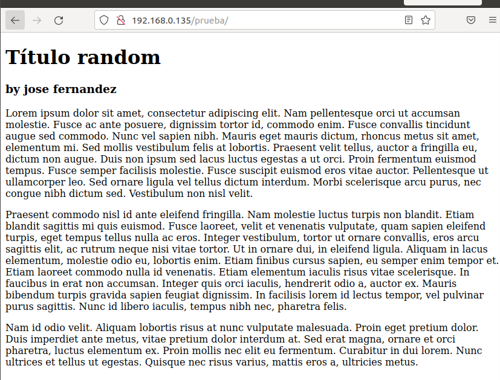
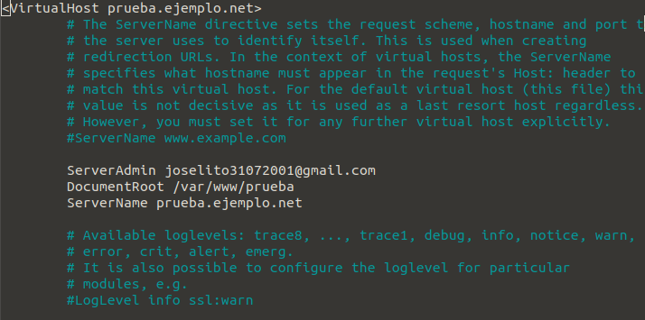
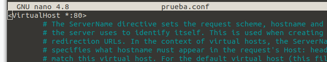

# Apache: Introducción

En este proyecto trabajaremos con el servidor web de `Apache`.

Manejaremos este servidor desde nuestro ordenador del centro y siempre trabajaremos en nuestro entorno `Ubuntu`.

### Que es Apache? 

`Apache` es un servidor HTTP de código abierto para plataformas Unix, este software está mantenido y desarrollado por _Apache Software Foundation_.

Este servidor es uno de los más antiguos y confiables, lleva en mercado desde el año 1995 y ya desde el año siguiente fue uno de los servidores más utilizados en todo el mundo gracias a su seguridad y estabilidad.

La principal funcionalidad de este software es servir contenido en la web a través del navegador mediante protocolos HTTP.

`Apache` es un software multiplataforma, ya que funciona tanto en servidores Unix como en Windows. Este software trabaja con una estructura de módulos permitiendo a los desarrolladores activar y desactivar nuevas funcionalidades. Algunos de estos módulos son los de seguridad, almacenamiento caché, autenticación de contraseña...

### Ventajas y desventajas de Apache:

Algunas de las principales ventajas de tener un servidor web Apache son:

* Es de código abierto y gratuito.
* Presenta parches de seguridad regulares.
* Estructura de módulos.
* Es multiplataforma.
* Buena personalización mediante _.htaccess_.
* Bastante popular y fácil de obtener.

Aunque este software también presenta algunas desventajas:

* Problemas de estabilidad con un gran número alto de conexiones
* Un abuso de los módulos puede presentar fallos de seguridad.

Aunque `Apache`sea uno de los servidores más utilizados del mercado existen otros tipos de servidores web.

### Alternativas Apache:

Algunas de las alternativas a `Apache` son:

* NGNIX (Engine-x): Fue lanzada en el año 2004 y ha ganado bastante popularidad, ya que resuelve ciertos problemas como el problema de estabilidad con un gran número de conexiones de Apache.

* LiteSpeed: Es un servidor web con muy buen rendimiento aparte de ser estable y seguro. Tiene una arquitectura diferente a Apache, ya que trabaja con los mismos procesos sin consumir muchos recuros.

* Caddy: Este servidor web también es open source y multiplataforma, utiliza el lenguaje de programación Go. Además es un software fácil de configurar, tiene una sencilla instalación y incorpora una seguridad por defecto.   

# Apache: Configuración

Para empezar a configurar `Apache` tendremos que tener instalado correctamente todos los paquetes. Si tenemos algun problema con la instalación del software podemos visitar la siguiente [página](https://www.digitalocean.com/community/tutorials/how-to-install-the-apache-web-server-on-ubuntu-20-04-es).

Una vez que tengamos instalado todo correctamente, procedermos a empezar nuestra configuración.

Creamos nuestra propia página HTML con la que vamos a trabajar en nuestro servidor `Apache`.

Podemos crearla directamente con cualquier editor.

Al ejecutar nuestro servidor con nuestra IP nos muestra la página por defecto:

Para trabajar con la página que hemos creado, tendremos que moverla a la carpeta raiz "/var/www". Dentro de esta carpeta procederemos a crear una subcarpeta y moveremos nuestro `index.html` dentro.

Podemos hacerlo manualmente o de la siguiente forma:

~~~
    sudo mkdir /var/ww/html/prueba
    sudo mv index.html /var/www/html/prueba
~~~

Después de mover nuestro `.html` para poder acceder a él mediante el navegadorde las siguiente forma:

    IP/nombreCarpeta

Al acceder se nos mostrará la página que hemos creado en mi caso es la siguiente:

Ahora que tenemos nuestra propia página web super funcional y queremos mostrarla a todo al mundo, procederemos a configurarla.

Nos situamos en la carpeta de configuración de Apache:

    cd /etc/apache2/sites-available/

Dentro de esta carpeta copiaremos el archivo predeterminado de configuración para nustra carpeta creada anteriormente:

    sudo cp 000-default.conf prueba.conf

Modificaremos el archivo de la siguiente forma:

    sudo nano prueba.conf

Dentro cambiaremos y pondremos el nombre de nuestro dominio en este caso "prueba.ejemplo.net" a la derecha de VirtualHost y seguidamente escribiremos lo siguiente:

1. Para definir el correo electronico de ayuda:
    
    "ServerAdmin [nuestro email]"

2. Para definir el directorio donde se encuntran nuestros archivos:

    "DocumentRoot /var/www/html/prueba"

3. El nombre de nuestro servidor:

    "ServerName prueba.ejemplo.net"

El archivo con mis datos quedaría tal que así:

Ahora que ya tenemos configurado nuestro servidor, procederemos a activar los virtual hosts con el siguiente comando:

    sudo a2ensite prueba.conf

Configurando mi página de prueba me ha pedido que ejecute el siguiente comando:

    sudo systemctl reload apache2

### Problema de direccion:

Al configurar la direccion de la página y acceder a ella se mostraba la página por defecto de de apache.

Existe algun tipo de problema al acceder a la direciión de la página, por lo tanto comprobaremos el archivo `prueba.conf`.

Dentro de este archivo, en vez de escribir la dirección dentro de VirtualHost, lo modificamos y ponemos "*:80" de tal manera:

Después de modificar el archivo guardamos y deshabilitamos el archivo:

    sudo a2dissite prueba.conf

    systemctl reload apache2

Por último volvemos a habilitar el archivo de configuración y volvemos a reiniciar apache:

    sudo a2ensite prueba.conf

    systemctl reload apache2

Finalmente comprobamos que nos sale la página que hemos creado buscando el dominio en el buscador.

## Bibliografía

* https://dinahosting.com/ayuda/que-es-apache-y-para-que-sirve/

* https://www.hostinger.es/tutoriales/que-es-apache/

* https://blog.acens.com/white-papers/alternativas-al-servidor-apache-whitepaper/
